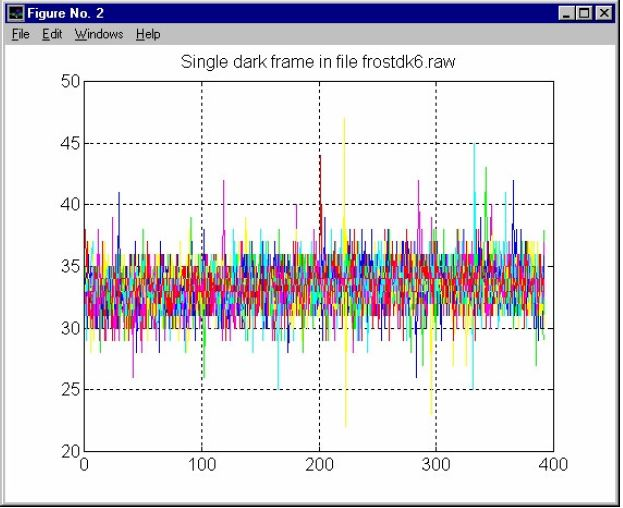
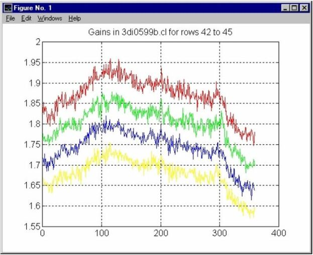
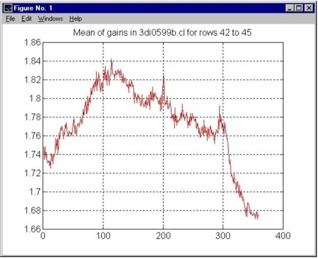
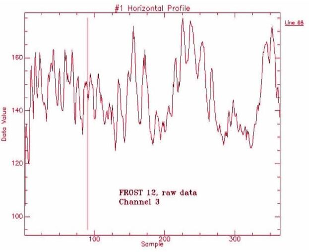
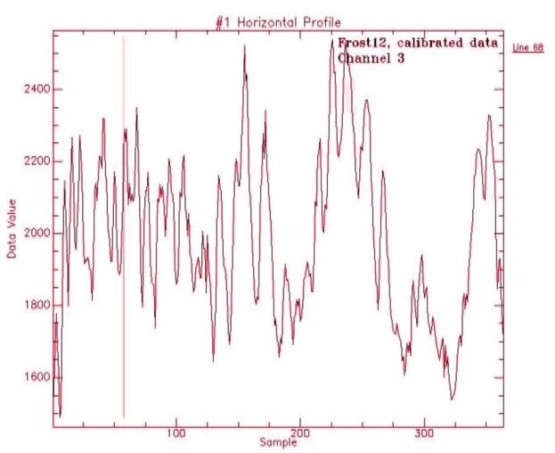

# 1. 소개
 
방사보정 프로세스는 보정 및 스케일링을 위해 매개변수를 올바르게 정의한 후에는 실제로 사용자에게 보이지 않는다. 그러나 사용자는 프로세스를 이해하기 위해 방정식과 단위를 알고 있어야 한다.
방사보정의 결과 이미지 데이터는 복사량 혹은 분광 복사량으로 활용가능하다. 때때로 방사 측정량에 대한 정확한 용어와 단위를 얻는 것은 매우 어려운 것처럼 보인다. 이는 방사 측정 분야에서 수십년동안 일해온 사람들에게도 마찬가지이다. 방사량에 대한 몇몇 추가정보는 ***참조***에서 확인가능하다.

# 2. 작업할 데이터 및 매개변수

 방사보정 수행을 위해, 다음과 같은 데이터가 필요하다.
* 원시데이터 (*raw data*)
* 교정계수파일 (*.cal*)
* 다크프레임 (원시데이터와 동일한 모드의 매개변수)
* 노출시간 (*integration time*)에 대한 정보

모든 측정 중 동일해야하는 가장 중요한 두 개의 매개변수는 시스템의 온도와 잡음(noise) 동작이다. 첫 번째 요소의 변경은 데이터 세트 간의 오프셋(offset, 잔류편차) 오류를 야기하여 잘못된 신호해석이 발생한다. 후자는 데이터의 예기치 않은 스파이크를 발생시키며, 이는 상쇄할 수 없다. 이는 낮은 응답성으로 높은 방사보정 이득(gain)을 갖는 분광채널에서 특히 중요한데, 이득이 있는 경우 잡음의 진폭도 곱하기 때문이다. 원시데이터 측정과 다크프레임은 동일한 노출시간을 사용하여 기록되어야 한다.

# 3. 단위 및 스케일링
## 3.1 원시데이터 및 다크프레임
원시데이터 및 다크프레임은 모두 데이터 숫자(D.N., Data Numbers)로 표현된다. 예를들어 12-bit AD변환이 적용되면, 그 결과 범위는 0~4095 D.N.이 된다. 다크 픽셀 보정은 원시데이터 프레임의 신호에서 다크프레임의 신호를 빼서 이미지에 적용된다. 이것은 픽셀 단위(Pixel-by-Pixel basis)로 수행되어야 한다. 이러한 데이터 세트간의 발생 오프셋(possible offset) 또는 잡음 차이로 인해 각각 잘못된 신호해석 또는 추가적인 신호변동이 발생할 수 있다.

## 3.2 교정(calibration) 파일
교정 파일(.cal)을 만들 때, 값의 스케일링은 복사 원천 응답 정보(radiance source response information)에 따라 계산된다. 원천에 대한 응답(response of the source)은 분광 복사 내에서 주어진다. 일반적으로 단위는 μW/㎠·sr·㎚ 또는 W/㎡·sr·㎛ (10 μW/㎠·sr·㎚ = 1 W/㎡·sr·㎛)이다. 만약 단위가 다르다면 방사적으로(radiometrically) 보정된 출력 데이터에서 다른 단위를 야기한다. 기본적으로 교정계수가 시간 1ms로 정규화되기 때문에 시간 단위도 ms가 되어야 한다. 따라서, 단위는 μW/㎠·sr·㎚이 되어야 하며, 자세한 정보는 5장 후반부 예시에서 찾을 수 있다. 어떤 이유로 이 시간 단위는 일반적으로 생략된다.
교정 파일은 데이터 행렬 내 각 픽셀에 대한 교정계수와 원시데이터 값에 대한 선형적인 보정 벡터 (4,096 numbers)가 포함된다. <i>이 경우에는 선형적인 보정이 필요하지 않아 제공되지 않았다.</i> 교정 파일은 교정 측정 및 원천 응답 파일에 따라 준비된다. 파일이 준비된 후, 사용자는 이 값을 제어할 수 없다. 응답 파일이 단위 혹은 μW/㎠·sr·㎚로 주어졌다 가정하면 교정 파일의 이득계수 단위는 (μW·ms/㎠·sr·㎚)/D.N.이다. 교정계수가 노출시간에 대해 정규화되는 이유는 우리가 노출시간을 알고있는 한 이러한 계수를 어떤데이터든 적용할 수 있기 때문이다.

## 3.3 가능한 추가적인 스케일링
결과가 일반적으로 오직 정수 값만 다룰 수 있는 컴퓨터 디스플레이에 표현되기 때문에, 때때로 데이터에 대해 추가적인 스케일링을 수행할 필요가 있다. 이는 데이터의 분광 복사 범위에 대한 사전(혹은 시행착오) 지식에 따라 수행된다. 결과에 대한 최상의 해상도를 얻는 것은 이미지의 최대 값에 따라 데이터를 스케일링 하는 것이다. 이는 실제로 결과를 원하는 범위로 정규화하는 것이다.

# 4. 방사보정 등식
방사보정 프로세스에서 보정된 단일 픽셀에 대한 분광복사량은 식(1)에 따라 계산된다.

<I>$Pc = \frac{Pr\times G}{Ti\times Bw}$</I>····························(1)

여기서,  
<I>Pr</I>: 다크 보정된 픽셀 값(여러 행의 신호 합계일 수 있음) 
<I>G</I>: 해당 픽셀에 대한 교정 이득치(여러 이득치의 평균일 수 있음) 
<I>Ti</I>: 노출 시간(ms)
<I>Bw</I>: 행 내 분광 채널의 대역폭

3.2장의 응답 파일을 가정하면 분광복사 <I>Pc</I>의 단위는 μW/㎠·sr·㎚가 된다. 값은 분광 범위 내의 행(row)의 위치에 따라 0.60-0.65㎚인 행 당 분광 샘플링으로 정규화된다. 복사(μW/㎠·sr)를 얻으려면 결과 값에 해당 행의 분광 샘플링 또는 행의 평균을 곱해야 한다. 
사용자는 표시된 값에 임의의 스케일링을 적용할 수 있다. 픽셀의 데이터 타입이 부호가 있는 경우(ex.16 bit number), 이는 $\pm$32767의 범위가 될 것이다. 스케일링은 식(2)에 의해 수행된다. 이는 사용자에게 스케일된 분광 복사(량)를 제공할 것이다.

<I>$Psc = 32768 \times \frac{Pc}{Rmax}$</I>····························(2)

여기서,  
<I>Pc</I>: 방사보정된 분광 복사(량), 단위 μW/㎠·sr·㎚ 
<I>Rmax</I>: 표시하고자 하는 최대 복사(량)

만약 지금 <I>Rmax</I>를 현명하게 e.g. 32,768이 되게 선택했다면, 표시되는 범위는 최대 32,768 μW/㎠·sr·㎚이다. 예를 들어 10μW/㎠·sr·㎚는 표현 값으로 10,000이 된다.

# 5. 예제

실제데이터와 교정 파일을 사용한 예를 들어보자. 먼저 다크프레임이 필요하다 Figure 1은 노이즈가 있지만, 현실에서 일어나는 좋은 예이다.

 <Figure 1. 잡음이 있는 다크프레임 데이터 샘플>

25개 채널의 구성을 사용해 데이터를 획득하였다. 각 행의 너비가 4이고, 노출시간은 23.6ms였다. 간단한 예제를 위해 33 D.N.의 다크 픽셀 값을 추정할 수 있다. 
이 예제에서 분광채널(#3) 중 하나를 선택해 보자. 구성에서는 490.96~497.44nm로 정의되고, 디텍터에서 42행으로부터 45행까지의 행에 도달한다. 이 행의 교정 이득(calibration gain)에 대한 지식이 필요하다. Figure 2에는 각 4개 행에 대한 이득의 공간 그래프가 나와있다. 센서 응답의 기울기가 빠르게 변화하고 있기 때문에 한 행에서 다른 행으로의 이득에 변동이 있다. 선택한 분광 채널의 평균 이득은 Figure 3에 나와있다. 

 <Figure 2. 42~45행에 대한 교정 이득>

FOV 내에서 한 지점(예: 50번째 열)을 선택하지 말라. 해당 열(및 행)의 평균 이득은 ca. 1.76으로 Figure 3의 평균이득 곡선 내에 나와 있다.

 <Figure 3. 행 #42~#45에 대한 교정 이득의 평균>

마지막으로, 원시 데이터가 필요하다. Figure 4는 다크프레임과 동일한 구성으로 비행 중에 기록된 파일에서 #42~#45행에 대한 원시데이터이다. 이 신호는 4개 행의 합계이다. 수직커서라인은 무시하라.

 <Figure 4. 행 #42~#45의 원시데이터 합계 샘플>

이제 예제에서 사용할 열 #50을 선택했다는 것을 상기하라. 합산된 원시데이터 값은 Figure 4에서 약 150 D.N.으로 나타난다. 
32.768의 <I>Rmax</I>가 사용된다는 것을 정의 할 때, 이 예제를 완료하기에 충분한 정보가 있다. 먼저 식(1)에 따라 이 픽셀의 분광 복사(량)를 계산한다.

<I>$Pc = \frac{Pr\times G}{Ti\times Bw}$</I>  
<I>$Pc = \frac{(150-33)D.N. \times 1.76(μW·ms/㎠·sr·㎚)/D.N.}{23.6 ms\times 4}$</I>  
<I>$Pc = 2.18 μW/㎠·sr·㎚$ 
 
 그런 다음 식(2)를 사용하여 스케일링을 얻는다.
 
 <I>$Psc = 32768 \times \frac{Pc}{Rmax}$</I>  
 <I>$Psc = 32768 \times \frac{2.18 μW/㎠·sr·㎚}{32.768 μW/㎠·sr·㎚}$</I>  
 <I>$Psc = 2180$</I> 
 
 #50열의 Figure 5에서 값이 C. 2180인지 확인할 수 있다. 수직 커서라인은 무시하라. 이제 복사(량)를 얻으려면 분광 복사(량)를 그 라인의 분광 샘플링과 곱해야 한다. 0.6nm 값을 예로 들어보자. 따라서 복사(량) <I>L</I>은,

<I>$L = 2.18 μW/㎠·sr·㎚ \times 0.6 ㎚$</I>  
<I>$L = 1.31 μW/㎠·sr$ 

 <Figure 5. 행 #42~#45의 원시데이터 합계 샘플>

# 6. 주의

CCD 디텍터를 사용할 때는 그러한 검출기의 기존 기능을 기억해야 한다. 이들 중 하나는 <b>스미어 보정</b>으로 암전류를 빼기 전에 원시데이터에 수행해야 한다.

# 7. 참조
1. William L. Wolfe, <I>"Introduction to Radiometry"</I>, SPIE Optical Engineering Press, 1988.
2. Norman S. Kopeika, <I>"A System Engineering Approach to Imaging"</I>, SPIE Optical Engineering Press, 1998.
3. Philip N. Slater, <I>"Remote Sensing Optics and Optical Systems"</I>, Addison-Wesley Publishing Company, 1980.

